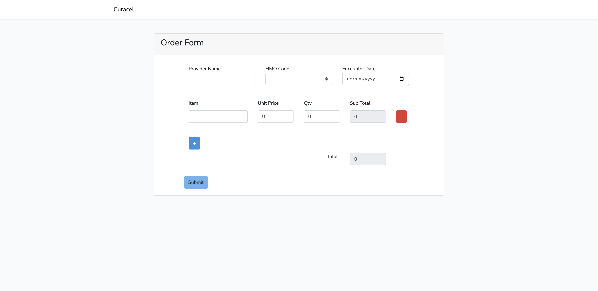

# Curacel HMO Order Collection System.

This application is an order collection system that satisfies the needs of HMOs.

## Setup

Run `composer install` - Install composer dependencies

Run `npm install` - Install NPM dependencies

Run `cp .env.example .env` - replace sample values with your database connection in the env

Run `php artisan key:generate` - Generate application key

Run `php artisan migrate` - Run the migrations

Run `php artisan db:seed --class=HmoSeeder` - Seed data into the DB

Run`php artisan serve` - Run application

The UI is displayed on the root page (usually http://127.0.0.1:8000/)

Don't forget to run `npm run dev` after modifying the vue component.

## Extra Notes

To run tests:

```
php artisan test (backend)
npm run test (frontend)
```

## Sample Image



