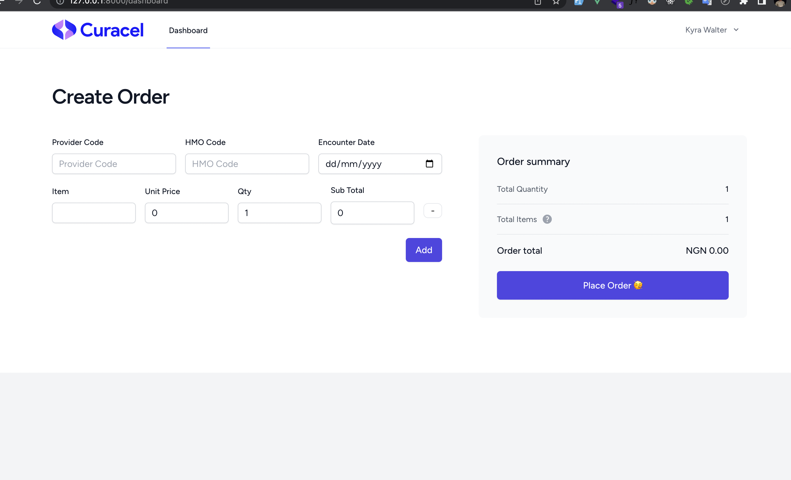

<p align="center">

</p>

<h1>Setup Steps</h3>

>composer install

>cp .env.example .env

>php artisan key:generate

>php artisan migrate

>php artisan db:seed

>npm install

>npm run dev

>php artisan serve

Create an account and login

<h3>Sets to get HMO Code and Provider Code</h3>

<h4>Provider</h4>
Go to the database ```providers``` table and copy the code

<h4>HMO Code </h4>
Go to the database ```hmos``` table and copy the code
