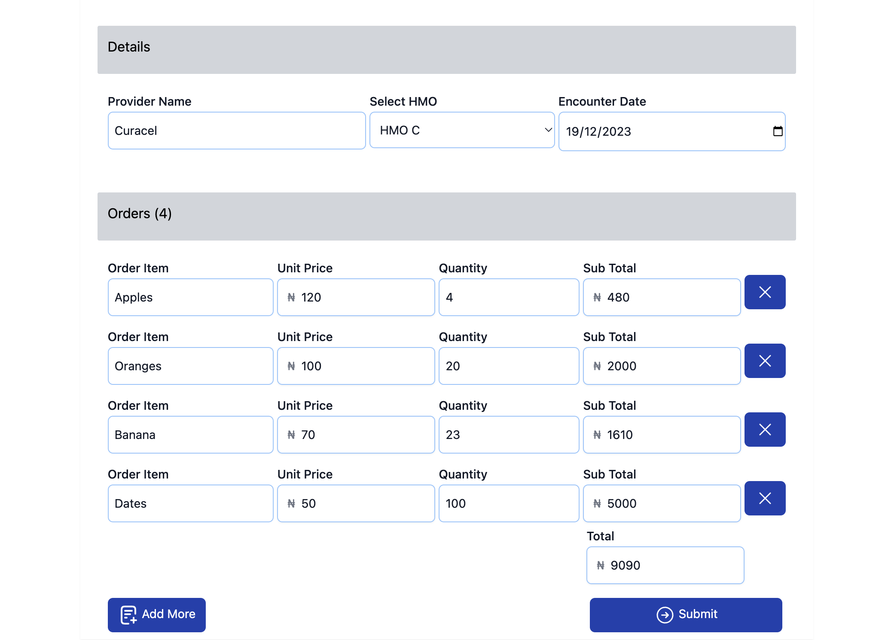

## Screenshot



## Setup

Same way you would install a typical laravel application.

    composer install --ignore-platform-reqs

    npm install

    php artisan serve

The UI is displayed on the root page

Don't forget to run `npm run dev` after modifying the vue component.

## Test Cases

### Backend

```composer test```


### Front-end

```npm run test```

## Batch orders monthly command

```php artisan curacel:process-batched-orders```
